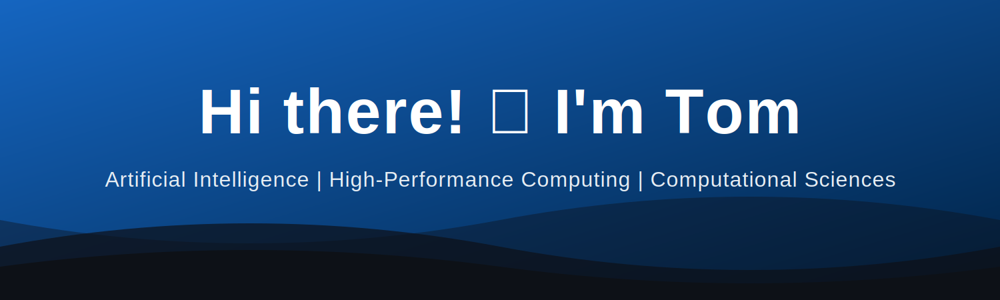

  
  
   
  

  &nbsp;&nbsp;

## 👨‍💻 About Me

💡 **Passionate about artificial intelligence, high-performance computing, image processing, and rendering.** 

✨ Always exploring efficient ways to translate academic research into production-ready engineering solutions.
 
| | |
| :--- | :--- |
| 🔭 **Currently working on** | Hackathon Challenge. |
| 🌱 **Currently learning** | Vibe Coding, AI Agent. |
| 🎓 **Education** | MSc in Computational Sciences. |
| 💼 **Background** | 5+ years of experience as an Algorithm Engineer in the medical device industry. |
| 📫 **How to reach me** | https://x.com/Tomyu_2034 |

## 🛠️ Tech Stack & Tools

  
  
  
  
  
  

 

  
    
 
  
  

 
  

  <i>🚀 Architecting algorithms, optimizing performance, and building intelligent systems。</i>

